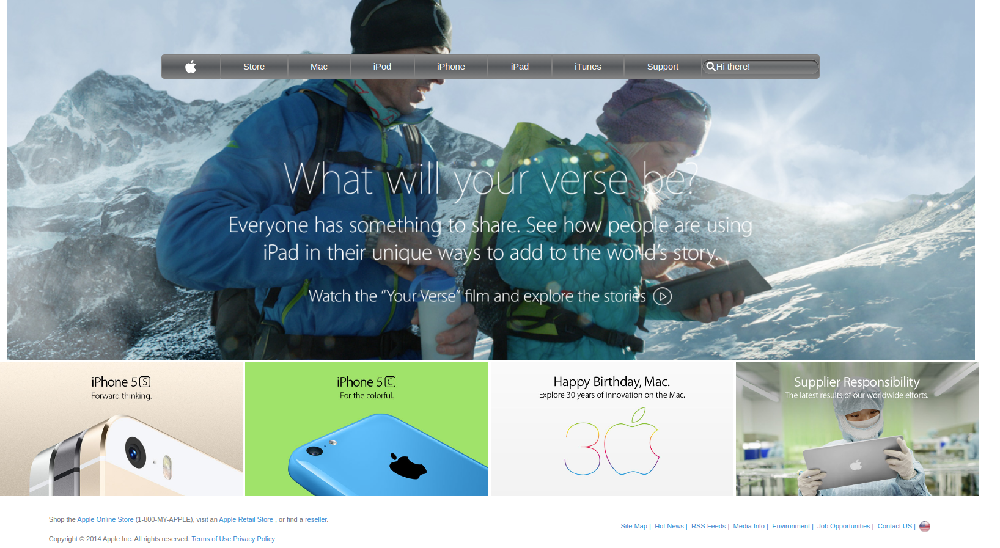

# apple.com website clone

> A clone of the apple.com website from 2014
> 

## Built With

- HTML 5
- CSS 3

*The search bar has a cool CSS transition. Type something in to test it out*

## Live Demo

[Live Demo Link](https://raw.githack.com/ikraamg/apple.com-clone/apple-clone-feature/index.html)

## Getting Started

To get a local copy up and running follow these simple example steps:

### Prerequisites

A browser of your choice, preferrably Chrome.

### Setup

- Fork/Clone this project to your local machine
- Open index.html in your browser

## Authors

👤 **Ikraam Ghoor**

- Github: [@ikraamg](https://github.com/ikraamg)
- Twitter: [@GhoorIkraam](https://twitter.com/GhoorIkraam)
- Linkedin: [isghoor](https://linkedin.com/isghoor)

## 🤝 Contributing

Contributions, issues and feature requests are welcome!

Feel free to check the .

## Show your support

Give a ⭐️ if you like this project!

## Acknowledgments

- The Odin project for the project plan
- Apple.com for the original website
- sanitize.css creators for the opinionated css reset file

## 📝 License
